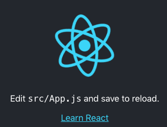

# Simple Boilerplate for React Context and Hooks
Small boilerplate for testing react without redux, but with context and hooks

## TODO
* add typescript
* reducer a part

## Prior
* install globally brew, nodejs and yarn:
    * brew
    * `brew install nodejs yarn`
* create a repo named "boilerplate-react-context-hooks" on git without licence

## Creation of basic react boilerplate
* `yarn add react-create-app`
* `cd Workspace && yarn create react-app boilerplate-react-context-hooks`
* `cd boilerplate-react-context-hooks && yarn start`

info : [Create React App](https://github.com/facebook/create-react-app).

Available Scripts : `yarn start|test|buikd|eject`

You should see in chrome:



## GITHUB
* git init
* git remote add origin https://github.com/nicolastrote/boilerplate-react-context-hooks.git
* git push --set-upstream origin master

## App.jsx and SCSS
* `cd src`
* remove logo : `rm logo.svg App.test.js`
* use jsx instead of js: `mv App.js App.jsx`
* use scss instead of css: `mv App.css App.scss`
* for scss node need node-sass: `yarn add node-sass`

re-write App.jsx as:
```typescript jsx
import React from 'react';

import TodoForm from './components/TodoForm';
import TodoList from './components/TodoList';
import './App.scss';

export default function App() {
  return (
    <div className="App">
      <h1>Todo App</h1>
      <div>
        <TodoForm />
        <TodoList />
      </div>
    </div>
  )
}
```

## Components TodoForm & TodoList
We will create 2 components, one for the general form of adding Todos and a 2d form for listing all todos.
All information are coming from local state for now.
We use react hooks for local state manipulation.
* `cd src`
* `mkdir components && cd components`
* `mkdir TodoForm && touch TodoForm/index.jsx`
* `mkdir TodoList && touch TodoList/index.jsx`

write src/components/TodoForm/index.jsx as
```typescript jsx
import React, { useState, useContext } from 'react';

export default function TodoForm() {
    const [todo, setTodo] = useState('');

    const handleTodoInput = (event) => {
        setTodo(event.target.value);
    };

    // submits todo to context store and set todo form input to blank
    const handleTodoSubmit = (event) => {
        event.preventDefault();
        todo.trim().length > 0 && console.log(todo);
        setTodo('');
    };

    return (
        <form onSubmit={handleTodoSubmit} className="todo-form">
            <input type="text" value={todo} onChange={handleTodoInput} />
            <button type="submit">Add Todo</button>
        </form>
    )
}
```
write src/components/TodoList/index.jsx as
```typescript jsx
import React, { useContext } from 'react';

export default function TodoList() {
    return <div className="todo-list">todo list</div>
};
```

## STORE
We will create a file for managing the store with context:
* cd src && mkdir store && cd store && touch Store.jsx

Write Store.jsx as
```typescript jsx
import React, { createContext, useReducer } from 'react';

const initialState = {}

export const Store = createContext(initialState)

const reducer = (state, action) => {
  switch (action.type) {
    default:
      return state
  }
}

export const StoreProvider = ({ children }) => {
  const [state, dispatch] = useReducer(reducer, initialState)

  return <Store.Provider value={{ state, dispatch }}>{children}</Store.Provider>
}
```

## INDEX.JSX
Now we need to wrap App component with StoreProvider for using context everywhere

* Re-write index.jsx as
```typescript jsx
import React from 'react'
import ReactDOM from 'react-dom'

import './index.scss'
import App from './App'
import { StoreProvider } from './store/Store';

const app = (
    <StoreProvider>
        <App />
    </StoreProvider>
);

ReactDOM.render(app, document.getElementById('root'));
```

## Reducer with Context API
Now we need to set reducers for storing information in our "store context".

re-write src/store/Store.jsx as
```typescript jsx
import React, { createContext, useReducer } from 'react';

const initialState = {
    todoList: [],
};

export const Store = createContext(initialState);

const addTodo = (state, todoText) => {
    const newTodo = {
        id:
            (state.todoList.length > 0 && state.todoList[state.todoList.length - 1].id + 1) ||
            0,
        text: todoText,
        tag: 'active',
    };

    return { ...state, todoList: [...state.todoList, newTodo] };
};

const removeTodo = (state, todoId) => {
    const newTodoList = state.todoList.filter(todo => todo.id !== todoId);

    return { ...state, todoList: newTodoList }
};

const editTodoTag = (state, todoId, tag) => {
    const todo = state.todoList.find(todo => todo.id === todoId);
    const todoIndex = state.todoList.indexOf(todo);
    const newTodo = { ...todo, tag };

    const newTodoList = [
        ...state.todoList.slice(0, todoIndex),
        newTodo,
        ...state.todoList.slice(todoIndex + 1),
    ];

    return { ...state, todoList: newTodoList }
};

const reducer = (state, action) => {
    switch (action.type) {
        case 'ADD_TODO':
            return addTodo(state, action.todoText);
        case 'REMOVE_TODO':
            return removeTodo(state, action.todoId);
        case 'EDIT_TODO_TAG':
            return editTodoTag(state, action.todoId, action.tag);
        default:
            return state;
    }
};

export const StoreProvider = ({ children }) => {
    const [state, dispatch] = useReducer(reducer, initialState);

    return <Store.Provider value={{ state, dispatch }}>{children}</Store.Provider>;
};
```

## ACTIONS
As we build reducers, now we can code actions.

* `cd src/store && touch Actions.jsx`
write Actions.jsx as 
```typescript jsx
export const addTodo = (todo, dispatch) => {
    dispatch({
        type: 'ADD_TODO',
        todoText: todo,
    })
};

export const removeTodo = (todoId, dispatch) => {
    dispatch({
        type: 'REMOVE_TODO',
        todoId,
    })
};

export const editTag = (todoId, tag, dispatch) => {
    dispatch({
        type: 'EDIT_TODO_TAG',
        todoId,
        tag,
    })
};
```

## Connect Global State with Components
Let's connect our reducer with components.
re-write src/components/TodoForm/index.jsx as
```typescript jsx
import React, { useState, useContext } from 'react';

import { addTodo } from '../../store/Actions';
import { Store } from '../../store/Store';

export default function TodoForm() {
    const { dispatch } = useContext(Store);
    const [todo, setTodo] = useState('');

    const handleTodoInput = (event) => {
        setTodo(event.target.value)
    };

    const handleTodoSubmit = (event) => {
        event.preventDefault();
        todo.trim().length > 0 && addTodo(todo, dispatch);
        setTodo('');
    };

    return (
        <form onSubmit={ handleTodoSubmit } className="todo-form">
            <input type="text" value={ todo } onChange={ handleTodoInput } />
            <button type="submit">Add Todo</button>
        </form>
    )
}
```

re-write src/components/TodoList/index.jsx as
```typescript jsx
import React, { useContext } from 'react';

import Todo from './Todo';
import { Store } from '../../store/Store';

export default function TodoList() {
    const { state, dispatch } = useContext(Store);

    const todoList = state.todoList.map(todo => (
        <Todo
            key={todo.id}
            todoId={todo.id}
            todoText={todo.text}
            todoTag={todo.tag}
            dispatch={dispatch}
        />
    ));

    return <div className="todo-list">{todoList}</div>;
}
```

create Todo component
* cd components/TodoList/ && touch Todo.jsx
* write Todo.jsx as:
```typescript jsx

```

